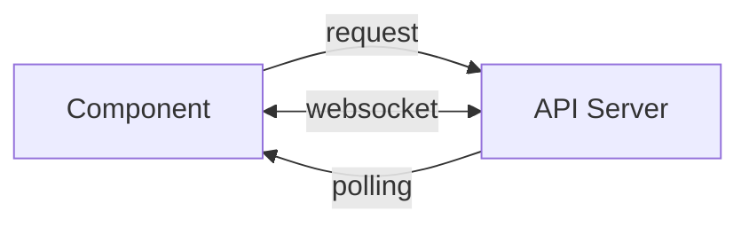
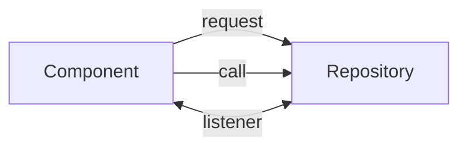
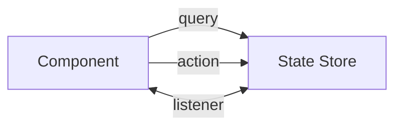

## State

### Direct Requests
Requests are made, like REST fetch calls to an API, directly from the components.

Polling or websockets are used to send information from the server. Eventually this
has to be done up the chain anyway.

**Benefits**

- Very simple
- Direct / no abstraction or indirection
- Sharing between components is forced to be top-down, which is simple
- Works well with a service worker that can overcome many hurdles

**Hurdles**

- Component must manage a copy of the state.
- Since state stays with the component, it must be refetched if the component goes away.
- Application / ui state cannot be managed.
- Decentralized / hard to manage because it is fetched and stored in various components.
- Sharing between components must be managed.
- No modularization, so we can't swap pieces out.

### Repository
A repository is an API that you query and call functions to change state.

The repository doesn't know anything about components, but components must listen
to the repository for updates

The components must then hold their own copy of the state or refer directly to the
repository.

### State Store
A state store holds and manages all state.

Again the state store doesn't know anything about components, and components
must listen for updates. State is directly updated or special 'actions' are called
that do the updating. Finally some state stores have a 'reducer' which is a fancy
object for merging actions onto the canonical state, as in the *Flux* pattern.
Often these two things are redundant.

### Thick Objects
Objects are 
